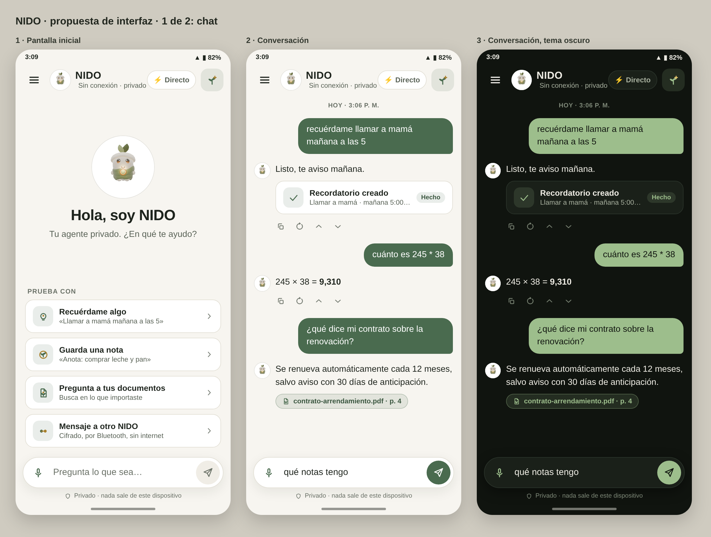

> **Idioma:** [English](README.md) · Español

<p align="center">
  
</p>

<h1 align="center">NIDO</h1>

<p align="center"><b>Tu agente, tu mundo.</b><br>
Un asistente de IA privado que funciona por completo en tu teléfono Android.</p>

<p align="center">
  <a href="https://github.com/Nido007-cmyk/Nido/releases"></a>
  <a href="https://github.com/Nido007-cmyk/Nido/actions/workflows/ci.yml"></a>
  <a href="LICENSE"></a>
  
</p>

<p align="center">
  
</p>
<p align="center"><sub>Maquetas de diseño del chat en v0.1.1-alpha. Las pantallas publicadas pueden diferir en detalles.</sub></p>

## Qué es NIDO

NIDO es un asistente personal que piensa en tu teléfono, no en el servidor
de otra persona. El modelo de lenguaje, tu memoria y tus documentos se quedan
en el dispositivo, cifrados. No hay cuentas, ni nube, ni analíticas.

> **Software en alfa.** NIDO es una alfa temprana para pruebas y comentarios.
> No ha pasado una auditoría de seguridad independiente. Todavía no confíes
> en él para secretos importantes. Consulta las
> [limitaciones conocidas](docs/ALPHA_RELEASE_NOTES.md#known-limitations).

## Qué hace hoy

- **Conversa sin conexión** con un modelo de lenguaje pequeño que corre en
  el teléfono (llama.cpp mediante `llama.rn`).
- **Recuerda por ti**: datos, notas y recordatorios, guardados en una base
  cifrada con SQLCipher. La clave vive en el Keystore de Android.
- **Actúa cuando se lo pides**: recordatorios, notas, eventos de calendario,
  conversión de unidades, cálculos, abrir enlaces. Todo lo que tiene efecto
  fuera de la app pide antes tu confirmación.
- **Responde con tus documentos**: importa archivos `.txt`, `.md`, `.csv`,
  `.json` o `.pdf` y NIDO los indexa en el teléfono.
- **Habla con otro NIDO por Bluetooth**: mensajes cifrados entre dos
  teléfonos emparejados, sin internet y sin servidor. El emparejamiento se
  hace en persona con un código QR.
- **Muestra su uso de red**: cada descarga que hace la app queda registrada
  y visible en la pantalla Acerca de.

La interfaz está disponible en español, inglés y portugués.

## Instalación

1. Descarga `app-release.apk` desde la
   [última versión](https://github.com/Nido007-cmyk/Nido/releases).
2. Compruébalo con el archivo `app-release.apk.sha256` publicado a su lado.
3. Instálalo en un teléfono Android (arm64).
4. En el primer arranque NIDO descarga su modelo de lenguaje, entre 0,5 y
   1 GB según la memoria del teléfono. Es la única vez que necesita internet.

## Privacidad y seguridad

- Los datos guardados se cifran con SQLCipher; la clave la custodia el
  Keystore de Android y la copia de seguridad en la nube de Android está
  desactivada.
- Si la clave no se puede leer, NIDO se detiene en lugar de abrir los datos
  sin cifrar.
- El contenido que viene de fuera (el mensaje de un contacto, un archivo,
  una nota) se trata como datos, nunca como instrucciones, y las acciones
  que escriben o envían algo después de leerlo piden confirmación.
- Los mensajes por Bluetooth van cifrados de extremo a extremo con claves
  intercambiadas por código QR (X25519, firmas Ed25519, XSalsa20-Poly1305).

Más detalle: [privacidad](docs/es/PRIVACY.md) · [arquitectura criptográfica](docs/es/CRYPTO_ARCHITECTURE.md) ·
[modelo de amenazas](docs/THREAT_MODEL_SUMMARY.md) · [reportar una vulnerabilidad](SECURITY.es.md)

## Estado

Alfa, octubre de 2026. El proyecto tiene más de 2300 pruebas automáticas y
ejecuta la comprobación de tipos y la batería de pruebas en cada cambio. Lo
que las pruebas automáticas no cubren es el comportamiento en hardware real:
el Bluetooth en particular varía según el modelo de teléfono, y la
validación con dos dispositivos sigue en curso.

Las limitaciones conocidas de la versión actual, incluido qué puede y qué no
puede restaurar un respaldo, están en las
[notas de la versión](docs/ALPHA_RELEASE_NOTES.md). Los cambios por versión
están en el [registro de cambios](CHANGELOG.md).

## Compilar desde el código

NIDO no funciona en Expo Go: usa módulos nativos. Necesitas el SDK y el NDK
de Android y un JDK, o una compilación con EAS.

```bash
npm install
npx expo prebuild -p android --clean
npx expo run:android --device
```

Comprobaciones que no necesitan un dispositivo:

```bash
npm run typecheck
npm test
```

La guía completa de compilación, con APK de release y firma, está en
[AGENTS.es.md](AGENTS.es.md).

## Estructura del proyecto

```
src/
  agent/      Agente: memoria, herramientas, bucle, política de seguridad
  p2p/        Mensajería NIDO a NIDO por Bluetooth
  privacy/    Gestión de claves y registro de red
  security/   Base cifrada, respaldo, bloqueo biométrico
  inference/  Motor del modelo de lenguaje en el dispositivo
  rag/        Indexado y búsqueda en documentos
  models/     Catálogo de modelos y descargas verificadas
  ui/         Pantallas y componentes
  i18n/       Textos en inglés, español y portugués
modules/      Módulos nativos de Android
docs/         Documentación (ver docs/README.md)
```

## Contribuir

Lo más útil ahora mismo son los reportes de errores y los comentarios de
quienes prueban la app. Usa las plantillas de issues. Para código, lee antes
[CONTRIBUTING.md](CONTRIBUTING.md) y el
[código de conducta](CODE_OF_CONDUCT.es.md).

## Créditos y licencia

NIDO se publica bajo la [Licencia MIT](LICENSE).

Nació como un fork de [BOAR](https://github.com/rferrari/boar-app), de los
contribuidores de aoair, también MIT. De BOAR se reutiliza la base de
inferencia y búsqueda sin conexión; el agente, el almacenamiento cifrado, la
política de seguridad y el protocolo Bluetooth son trabajo propio de NIDO.
[ATTRIBUTION.es.md](ATTRIBUTION.es.md) detalla qué viene de dónde.
